<!-- ╔══════════════════════════════════════════════════════╗ -->
<!-- ║   Zamir — GitHub Profile README                     ║ -->
<!-- ║   Made with 💜 & ☕ from Xorazm-01, Uzbekistan       ║ -->
<!-- ╚══════════════════════════════════════════════════════╝ -->

  

  

 

 

  
  &nbsp;
  
  &nbsp;
  
  &nbsp;
  

 

  
  &nbsp;
  
  &nbsp;
  
  &nbsp;
  

 

---

##  &nbsp;`whoami --full`

 

<table align="center" border="0">
<tr>
<td width="52%" valign="top">

### 🧑‍🚀 &nbsp;Zamir

> *"Turning coffee into scalable APIs since 2022.*
> *Debugging at 3AM is not a bug — it's a lifestyle."*

 

| | |
|---|---|
| 🔭 | Production-ready backend systems qurmoqdaman |
| 🌱 | FastAPI · Celery · Kubernetes o'rganmoqdaman |
| 💡 | REST API · Microservices · Clean Architecture |
| 🎯 | SOLID principles · Design Patterns · TDD |
| 🧠 | Muammolarni birinchi hal qilaman, keyin kod yozaman |
| ☕ | Coffee → Code → `git commit` → `git push` → Repeat |
| 🌙 | 3AM debugging sessiyalari — bu mening superkuchim |
| 🌍 | Xorazm, Uzbekistan 🇺🇿 |
| 📬 | szamir2197@gmail.com |

</td>
<td width="48%" align="center" valign="top">

  

</td>
</tr>
</table>

 

---

## 🛠️ &nbsp;`tech_stack --all`

 

<table>
<tr>
<td align="center" width="110">
  
   <b>Python</b>
</td>
<td align="center" width="110">
  
   <b>Django</b>
</td>
<td align="center" width="110">
  
   <b>FastAPI</b>
</td>
<td align="center" width="110">
  
   <b>Flask</b>
</td>
<td align="center" width="110">
  
   <b>PostgreSQL</b>
</td>
<td align="center" width="110">
  
   <b>Redis</b>
</td>
<td align="center" width="110">
  
   <b>Docker</b>
</td>
</tr>
<tr>
<td align="center" width="110">
  
   <b>Linux</b>
</td>
<td align="center" width="110">
  
   <b>Nginx</b>
</td>
<td align="center" width="110">
  
   <b>Git</b>
</td>
<td align="center" width="110">
  
   <b>GitHub</b>
</td>
<td align="center" width="110">
  
   <b>VS Code</b>
</td>
<td align="center" width="110">
  
   <b>Postman</b>
</td>
<td align="center" width="110">
  
   <b>CI/CD</b>
</td>
</tr>
</table>

 

**Languages**

**Frameworks**

 

---

## 📊 &nbsp;`github stats --verbose`

 

  

 

  
  &nbsp;
  

 

  

 

---

## 🎯 &nbsp;`mission_control --live-status`

 

<table>
<thead>
<tr>
<th align="center">🛸 Status</th>
<th align="left">📋 Mission</th>
<th align="center">⚡ Priority</th>
<th align="center">📈 Progress</th>
</tr>
</thead>
<tbody>
<tr>
<td align="center">✅ <b>DEPLOYED</b></td>
<td>Clean & Pythonic code standartlari</td>
<td align="center">🔴 CRITICAL</td>
<td><code>████████████ 100%</code></td>
</tr>
<tr>
<td align="center">✅ <b>DEPLOYED</b></td>
<td>Django + DRF production REST API</td>
<td align="center">🔴 CRITICAL</td>
<td><code>███████████░ &nbsp;92%</code></td>
</tr>
<tr>
<td align="center">✅ <b>DEPLOYED</b></td>
<td>PostgreSQL + Redis database layer</td>
<td align="center">🟠 HIGH</td>
<td><code>██████████░░ &nbsp;85%</code></td>
</tr>
<tr>
<td align="center">✅ <b>DEPLOYED</b></td>
<td>Docker containerization workflow</td>
<td align="center">🟠 HIGH</td>
<td><code>█████████░░░ &nbsp;80%</code></td>
</tr>
<tr>
<td align="center">🔄 <b>IN ORBIT</b></td>
<td>FastAPI + async/await patterns</td>
<td align="center">🔴 CRITICAL</td>
<td><code>████████░░░░ &nbsp;68%</code></td>
</tr>
<tr>
<td align="center">🔄 <b>IN ORBIT</b></td>
<td>Celery background task queues</td>
<td align="center">🟠 HIGH</td>
<td><code>███████░░░░░ &nbsp;55%</code></td>
</tr>
<tr>
<td align="center">🛸 <b>LAUNCHING</b></td>
<td>Microservices architecture design</td>
<td align="center">🟡 MED</td>
<td><code>████░░░░░░░░ &nbsp;35%</code></td>
</tr>
<tr>
<td align="center">📅 <b>QUEUED</b></td>
<td>Kubernetes + container orchestration</td>
<td align="center">🟡 MED</td>
<td><code>██░░░░░░░░░░ &nbsp;20%</code></td>
</tr>
<tr>
<td align="center">🌌 <b>DREAMING</b></td>
<td>Backend universumini zabt etish 🚀</td>
<td align="center">∞ INFINITE</td>
<td><code>∞∞∞∞∞∞∞∞∞∞∞∞ &nbsp;∞%</code></td>
</tr>
</tbody>
</table>

 

---

## 📅 &nbsp;`git log --journey --oneline`

 

| 🗓️ Yil | 🚀 Voqea | 🏷️ Tag |
|:------:|:---------|:------:|
| **2022** | 🐍 Python bilan birinchi tanishuv → `print("Hello, World!")` | `v0.1.0` |
| **2022** | 📖 Algorithmlar, data structures, OOP asoslari | `v0.2.0` |
| **2023** | 🌐 Django Framework → birinchi web ilovam yaratildi | `v0.5.0` |
| **2023** | 🗄️ PostgreSQL & SQLite → database dunyosi kashf etildi | `v0.6.0` |
| **2023** | 🔌 REST API + DRF → backend API craftsman bo'ldim | `v0.8.0` |
| **2024** | ⚡ Redis · Celery · async task queue | `v1.0.0` |
| **2024** | 🐳 Docker → containerize qila boshladim | `v1.2.0` |
| **2024** | 🧪 Unit testing · Pytest · TDD methodology | `v1.4.0` |
| **2024** | 🔐 JWT · OAuth2 · API security best practices | `v1.5.0` |
| **2025** | 🚀 FastAPI → yangi horizont ochildi | `v2.0.0` |
| **2025** | ☁️ AWS · Cloud deployment · CI/CD pipelines | `v2.3.0` |
| **2025** | 🏗️ Microservices architecture exploration | `v2.5.0` |

 

---

## 🧠 &nbsp;`principles --core`

 

<table>
<tr>
<td align="center" width="220">

### 🔵 SOLID

**S** — Single Responsibility 
**O** — Open/Closed 
**L** — Liskov Substitution 
**I** — Interface Segregation 
**D** — Dependency Inversion

</td>
<td align="center" width="220">

### 🟣 Clean Code

**DRY** — Don't Repeat Yourself 
**KISS** — Keep It Simple 
**YAGNI** — You Ain't Gonna Need It 
**TDD** — Test Driven Dev 
**CR** — Code Review always

</td>
<td align="center" width="220">

### 🟢 My Rules

**☕** — Coffee before code 
**🧪** — Test everything 
**📖** — Docs matters 
**🔒** — Security first 
**🚀** — Ship it fast

</td>
</tr>
</table>

 

---

## 📊 &nbsp;`contributions --calendar`

 

 

 

&nbsp;

&nbsp;

 

---

## 🐍 &nbsp;`git log --contributions`

  

---

## 💬 &nbsp;`wisdom --random`

 

 

> 💡 **Mening shaxsiy falsafam:**
>
> *"First, solve the problem. Then, write the code."*
> *"Make it work, make it right, make it fast."*
> *"Code is read more often than it is written."*

 

---

## 🌐 &nbsp;`connect --all-channels`

 

&nbsp;

&nbsp;

&nbsp;

  

&nbsp;

&nbsp;

 

---

<!-- ╔══════════════════════════════════════════════════════╗ -->
<!-- ║  Made with 💜, ☕ and 3AM debugging from Xorazm-01    ║ -->
<!-- ║  github.com/szamir2197                               ║ -->
<!-- ╚══════════════════════════════════════════════════════╝ -->
